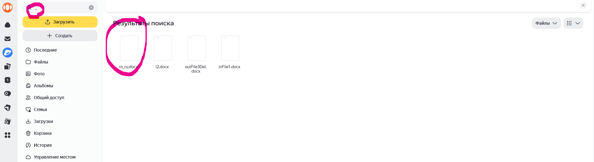
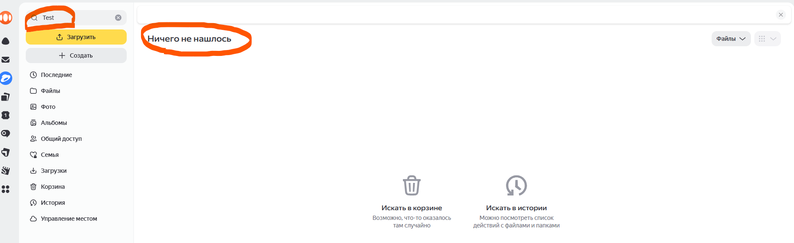
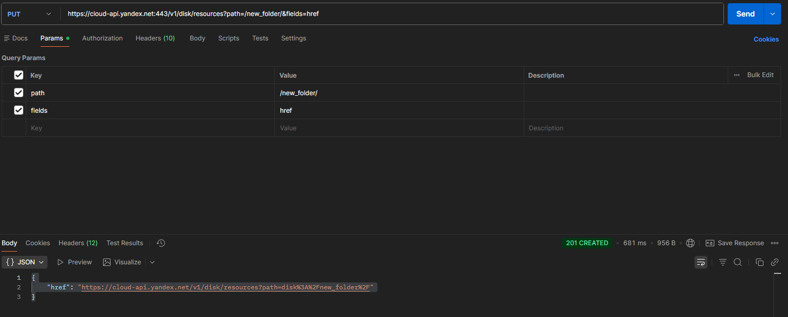
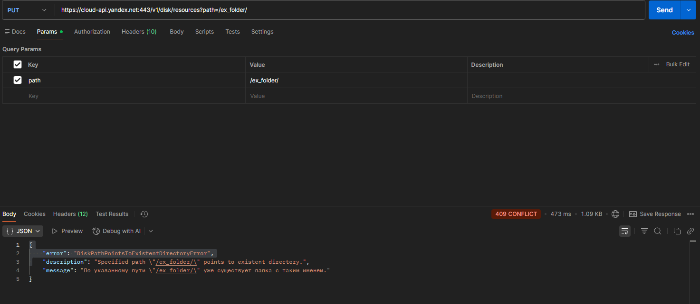

# Баг-репорты:

## UI:

### Некорректное поведение поиска при использовании специальных символов
### ID: BR-UI-1

Приоритет: Средний

Серьезность: Значительная

Окружение:
- Версия ПО: Яндекс.Диск веб версия (актуальная версия на момент тестирования)
- Браузер: Chrome 120.0

Предусловие: На Яндекс.Диск пользователя сохранены два файла (например, `inFile.docx` и `ro_ru.docx`).

Шаги воспроизведения:
1. Открыть Яндекс.Диск.
2. Ввести в поле поиска любой специальный символ (например, `_`, `#`, `.`).
3. Кликнуть на кнопку поиска.

Ожидаемый результат:
- В результатах поиска отображаются только файлы, содержащие введенный символ.

Фактический результат:
- При вводе специального символа в поисковую строку в результатах отображаются все файлы на Диске, а не только содержащие этот символ.

Доказательства:
Скриншот: 

-----------------------------------------------------------------------------
### Сообщение при отсутсвующих результатах поиска не соответсвует требованиям
### ID: BR-UI-2

Приоритет: Низкий

Серьезность: Незначительная

Окружение:
- Версия ПО: Яндекс.Диск веб версия (актуальная версия на момент тестирования)
- Браузер: Chrome 120.0

Предусловие: На Яндекс.Диск пользователя нет сохраненного файла/папки с именем `Test`.

Шаги воспроизведения:
1. Открыть Яндекс.Диск.
2. Ввести в поле поиска `Test`.
3. Кликнуть на кнопку поиска.

Ожидаемый результат:
- Если файлов/папок, содержащих данное имя, нет, отображается сообщение: `В вашем Диске не найдено файлов или папок по запросу <...>`.

Фактический результат:
- При отсутствии результатов поиска вместо требуемого сообщения отображается текст: `Ничего не нашлось`.

Доказательства:
Скриншот:

## API:

### Несоответствие кода ответа при успешном создании папки.
### ID: BR-API-1

Приоритет: Средний

Серьезность: Значительная

Окружение:
- API: Яндекс.Диск REST API
- Postman 11.82.6
- URL: `https://cloud-api.yandex.net:443/v1/disk/resources`
- Метод: PUT

Описание:
При успешном создании папки через API сервер возвращает код ответа **201**, хотя в требованиях указан код **200**.

Шаги для воспроизведения:
1. Подготовить валидный OAuth-токен для авторизации.
2. Отправить PUT-запрос на указанный URL с параметрами:
    Заголовки: `Content-Type: application/json, Authorization: {токен}`
    Query-параметры: `path=/new_folder/, fields=href`.
3. Проверить код ответа сервера.

Ожидаемый результат:
- Код ответа: **200**.
- Папка создается по указанному пути.

Фактический результат:
- Код ответа: **201**.
- Папка создается, но код не соответствует требованиям.

Доказательства:
Скриншот:

-----------------------------------------------------------------------------------------------------------------------
### Несоответствие кода ответа при попытке создания папки по существующему пути: ожидается **400**, возвращается **409**.
### ID: BR-API-2

Приоритет: Средний

Серьезность: Значительная

Окружение:
- API: Яндекс.Диск REST API
- Postman 11.82.6
- URL: `https://cloud-api.yandex.net:443/v1/disk/resources`
- Метод: PUT

Описание:
При попытке создания папки по уже существующему пути сервер возвращает код ответа **409**, хотя в требованиях указан код **400**.

Шаги для воспроизведения:
1. Подготовить валидный OAuth-токен для авторизации.
2. Создать папку по пути `/ex_folder` (если она еще не существует).
3. Отправить PUT-запрос на указанный URL с параметрами:
    Заголовки: `Content-Type: application/json, Authorization: {токен}`
    Query-параметры: `path=/ex_folder`.
4. Проверить код ответа сервера.

Ожидаемый результат:
- Код ответа: **400**.

Фактический результат:
- Код ответа: **409**.

Доказательства:
Скриншот:

